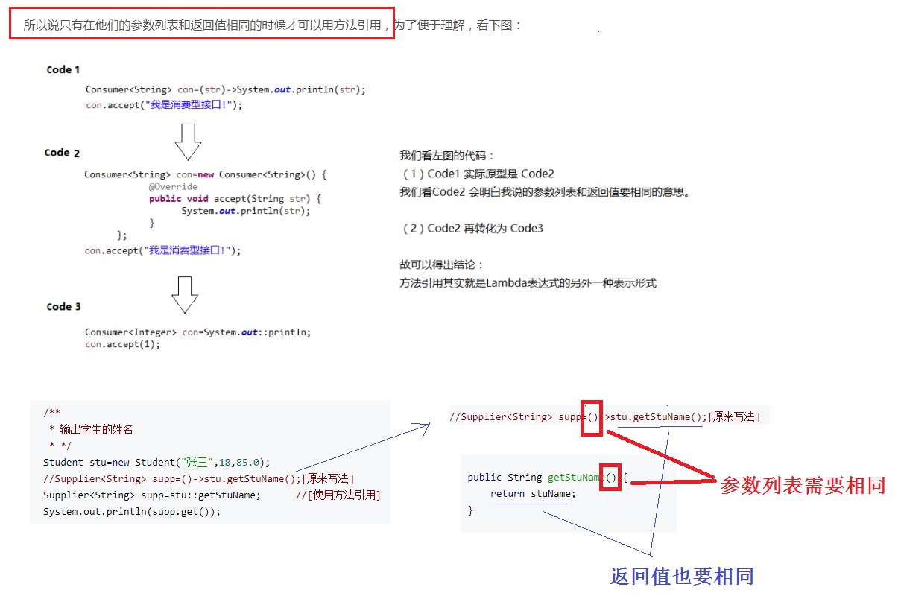

## JAVA 8 新特性（汪文军）


### 1. Lambda语法

(1) () -> {}
(2) () -> "Raoul"
(3) () -> {return "Mario";}   // 存在语句，最外层需要有大括号

#### 1.1 方法引用



### 2. Stream用法

#### 2.1 创建stream

从集合，值，数组中创建

```java
	private static Stream<String> FromCollection() {
        List<String> list = Arrays.asList("hello", "alex", "wangwenjun");
        return list.stream();
    }

    private static Stream<String> fromValues() {
        return Stream.of("hello", "alex", "wangwenjun", "world", "stream");
    }

    private static Stream<String> fromArrays() {
        String[] strings = {"hello", "alex", "wangwenjun", "world", "stream"};
        return Arrays.stream(strings);
    }
```

#### 2.2 stream的使用

```java
public class SimpleStream {
    public static void main(String[] args) {
       //have a dish list (menu)
    List<Dish> menu = Arrays.asList(
            new Dish("pork", false, 800, Dish.Type.MEAT),
            new Dish("beef", false, 700, Dish.Type.MEAT),
            new Dish("chicken", false, 400, Dish.Type.MEAT),
            new Dish("french fries", true, 530, Dish.Type.OTHER),
            new Dish("rice", true, 350, Dish.Type.OTHER),
            new Dish("season fruit", true, 120, Dish.Type.OTHER),
            new Dish("pizza", true, 550, Dish.Type.OTHER),
            new Dish("prawns", false, 300, Dish.Type.FISH),
            new Dish("salmon", false, 450, Dish.Type.FISH));
// 过滤，满足条件的保留下来
        List<Dish> menuP = menu.stream()
                .filter(a -> a.getName().startsWith("p"))
                .collect(toList());
// 取出某些字段重组为List
        List<Dish.Type> menuM = menu.stream()
                .map(Dish::getType)
                .collect(toList());
// calories 升序排序
        List<Dish> menuS = menu.stream().sorted(
                Comparator.comparing(Dish::getCalories))
                .collect(toList());
// calories 升序排序 Comparator当中有很多方法，如comparingLong
        menu.sort(Comparator.comparingInt(Dish::getCalories));
// distinct() 必须要求自定义类Dish重写hashCode和equal
        List<Dish> menuDis = menu.stream()
                .distinct()
                .collect(toList()); 
// findFirst()用法第一个元素
        Optional<Dish> menuF = menu.stream()
                .distinct().findFirst();
        menuF.ifPresent(a-> System.out.println(a));
        
// allMatch()必须全部匹配成功才正确，还有anyMatch()，noneMatch()
        boolean matched =  menu.stream().allMatch(i -> i.getCalories() > 400);
// reduce()用法 reduce在求和、求最大最小值等方面都可以很方便的实现
        Optional<Integer> menuRe =  menu.stream().map(Dish::getCalories).reduce((a,b)->a>b?a:b);
        Integer max = s.reduce(new BinaryOperator<Integer>() {
            @Override
            public Integer apply(Integer integer, Integer integer2) {
                return integer >= integer2 ? integer : integer2;
            }
        }).get();
 /**
 * 求最大值，也可以写成Lambda语法：
 * Integer max = s.reduce((a, b) -> a >= b ? a : b).get();
 */       
}
```

### 3. Optional用法

```java
// 如果包装的东西里面不为null，才会执行ifPresent()里面的东西
Optional.ofNullable(null).ifPresent(t -> {
            System.out.println("abc");
            System.out.println("abc");
            System.out.println("abc");
            System.out.println("abc");
        }
);
```

```java
 private static String getInsuranceName(Insurance insurance) {
        if (null == insurance)
            return "unknown";
        return insurance.getName();
    }

    private static String getInsuranceNameByOptional(Insurance insurance) {
        return     Optional.ofNullable(insurance).map(Insurance::getName).orElse("unknown");
    }
```

```java
// 防止List结果为NULL时的处理方法，数据查询未NULL的处理
List<Apple> greenList = list.stream().filter(a -> a.getColor().equals("green")).collect(Collectors.toList());
    Optional.ofNullable(greenList).ifPresent(System.out::println);
```
### 4. Collector用法

```java
   List<Apple> list = Arrays.asList(new Apple("green", 150)
                , new Apple("yellow", 120)
                , new Apple("green", 170)
                , new Apple("green", 150)
                , new Apple("yellow", 120)
                , new Apple("green", 170));
// 分组方式一
private static Map<String, List<Apple>> groupByNormal(List<Apple> apples) {
        Map<String, List<Apple>> map = new HashMap<>();
        for (Apple a : apples) {
            List<Apple> list = map.get(a.getColor());
            if (null == list) {
                list = new ArrayList<>();
                map.put(a.getColor(), list);
            }
            list.add(a);
        }
        return map;
    }
// 分组方式二
private static Map<String, List<Apple>> groupByFunction(List<Apple> apples) {
        Map<String, List<Apple>> map = new HashMap<>();
        apples.parallelStream().forEach(a -> {
            List<Apple> colorList = Optional.ofNullable(map.get(a.getColor())).orElseGet(() -> {
                List<Apple> list = new ArrayList<>();
                map.put(a.getColor(), list);
                return list;
            });
            colorList.add(a);
        });
        return map;
    }
```
Collectors求平均值

```java
Optional.ofNullable(menu.stream().collect(Collectors.averagingDouble(Dish::getCalories))).ifPresent(System.out::println);
```
Collectors进行分组

```
private static Map<String, List<Apple>> groupByCollector(List<Apple> apples) {
        return apples.parallelStream().collect(groupingBy(Apple::getColor));
    }
```

### 5. 新日期和时间

LocalDate、 LocalTime、 Instant、 Duration 以及 Period

```
    private static void testLocalDate() {
        LocalDate localDate = LocalDate.of(2016, 11, 13);
        System.out.println(localDate.getYear());
        System.out.println(localDate.getMonth());
        System.out.println(localDate.getMonthValue());
        System.out.println(localDate.getDayOfYear());
        System.out.println(localDate.getDayOfMonth());
        System.out.println(localDate.getDayOfWeek());

        localDate.get(ChronoField.DAY_OF_MONTH);
    }
```

```
   private static void testLocalTime() {
        LocalTime time = LocalTime.now();
        System.out.println(time.getHour());
        System.out.println(time.getMinute());
        System.out.println(time.getSecond());
    }
```

```
 private static void combineLocalDateAndTime() {
        LocalDate localDate = LocalDate.now();
        LocalTime time = LocalTime.now();

        LocalDateTime localDateTime = LocalDateTime.of(localDate, time);
        System.out.println(localDateTime.toString());
        LocalDateTime now = LocalDateTime.now();
        System.out.println(now);
    }
```

    private static void testInstant() throws InterruptedException {
            Instant start = Instant.now();
            Thread.sleep(1000L);
            Instant end = Instant.now();
            Duration duration = Duration.between(start, end);
            System.out.println(duration.toMillis());
        }
        
    private static void testDuration() {
        LocalTime time = LocalTime.now();
        LocalTime beforeTime = time.minusHours(1);
        Duration duration = Duration.between(time, beforeTime);
        System.out.println(duration.toHours());
    }
    
    private static void testPeriod() {
        Period period = Period.between(LocalDate.of(2014, 1, 10), LocalDate.of(2016, 1, 10));
        System.out.println(period.getMonths());
        System.out.println(period.getDays());
        System.out.println(period.getYears());
    }
    
    private static void testDateFormat() {
        LocalDate localDate = LocalDate.now();
        LocalDateTime localDateTime=LocalDateTime.now();
        String format1 = localDate.format(DateTimeFormatter.BASIC_ISO_DATE);
        String format2 = localDateTime.format(DateTimeFormatter.ISO_DATE_TIME);
        System.out.println(format1);
        System.out.println(format2);
    
        DateTimeFormatter mySelfFormatter = DateTimeFormatter.ofPattern("yyyy-MM-dd");
        String format = localDate.format(mySelfFormatter);
        System.out.println(format);
    }
    
    private static void testDateParse() {
        String date1 = "20161113";
        LocalDate localDate = LocalDate.parse(date1, DateTimeFormatter.BASIC_ISO_DATE);
        System.out.println(localDate);
        
        DateTimeFormatter mySelfFormatter = DateTimeFormatter.ofPattern("yyyy-MM-dd");
        String date2 = "2016-11-13";
        LocalDate localDate2 = LocalDate.parse(date2, mySelfFormatter);
        System.out.println(localDate2);
    }